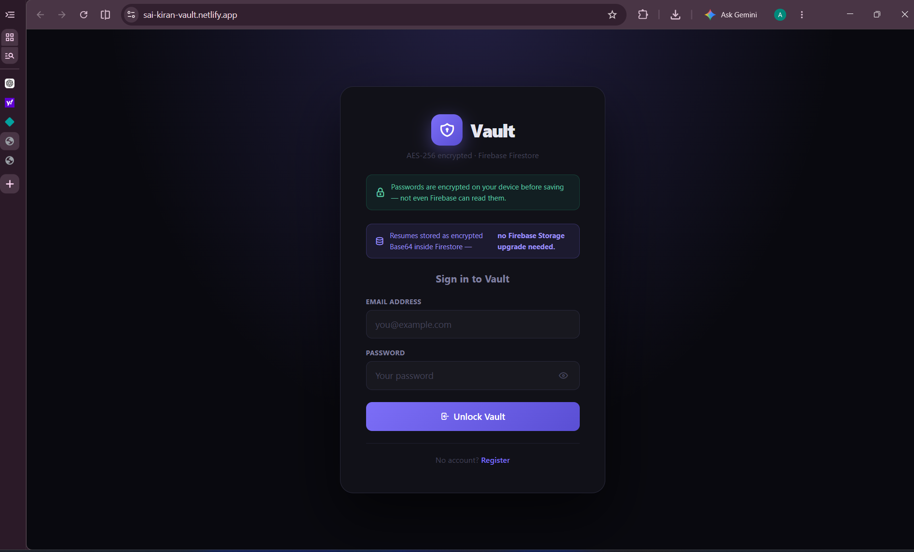
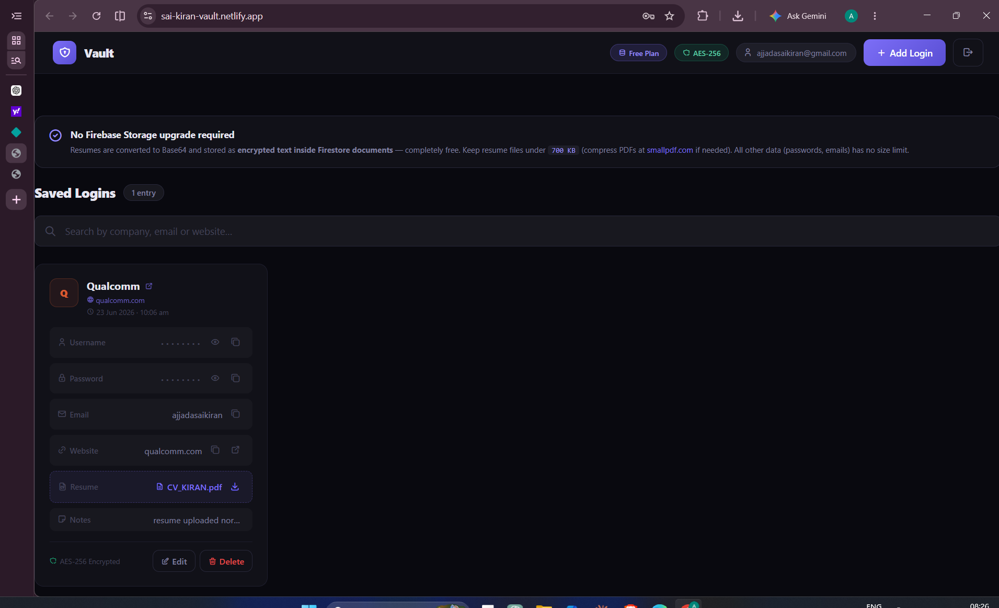

# Password-Vault
🔐 SecureVault is a web-based credential and job application manager that helps organize company accounts, passwords, emails, resumes, and notes through a clean and responsive interface.

# 🔐 SecureVault

SecureVault is a modern web-based credential manager designed to organize and securely store job application accounts, passwords, emails, resumes, and notes through a clean and responsive interface.

🌐 **Live Demo:** https://sai-kiran-vault.netlify.app/

---

## ✨ Features

- 🔐 Master Login System
- ➕ Add New Credentials
- ✏️ Edit Existing Entries
- 🗑️ Delete Entries
- 🔍 Search Functionality
- 👁️ Show/Hide Password
- 📋 Copy Username and Password
- 🌐 Company Website Links
- 📧 Email Management
- 📄 Resume/CV Upload Support
- 📝 Notes Section
- 🕒 Automatic Date & Time Tracking
- 🌙 Modern Dark UI
- 📱 Responsive Design

---

## 🛠️ Built With

- HTML5
- CSS3
- JavaScript
- Local Storage

---

## 📸 Screenshots

### Login Page

### Dashboard

---

## 🚀 Live Website

Visit the project here:

👉 **https://sai-kiran-vault.netlify.app/**

---

## 🔮 Future Improvements

- Firebase Authentication
- Firestore Database Integration
- Firebase Storage for Resume Uploads
- AES Password Encryption
- Application Status Tracking
- Export / Import Backup
- Multi-device Synchronization
- Enhanced Security Features

---

## ⚠️ Disclaimer

This repository contains only demonstration code and screenshots. All screenshots use sample data. No personal credentials, passwords, or sensitive information are included.

---

## 👨‍💻 Author

**Sai Kiran Ajjada**

Electronics and Communication Engineering Graduate

GitHub: https://github.com/YOUR_USERNAME

---

⭐ If you like this project, consider giving it a star!
